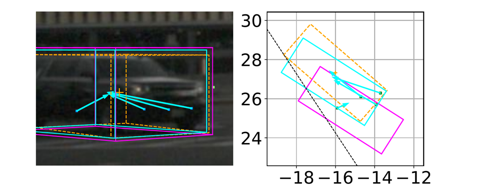

# RADIANT: Radar-Image Association Network for 3D Object Detection


**Visualization of predicted radar offsets (cyan arrows) to object centers and detections on image and BEV. The radar association of the RADIANT corrects the localization error of the monocular methods, improving detection performance. Orange, magenta and cyan boxes are GT bounding boxes, monocular detections, and RADIANT detections, respectively.**

## Directories
```plain
radiant/
    data/                           							 
        nuscenes/                 		    
                maps/
                samples/
                sweeps/
                v1.0-trainval/
                v1.0-test/
                fusion_data/                
    lib/
    scripts/
    checkpoints/                   				   	                          				
```

## Setup
- Create a conda environment
```bash
conda create -n radiant python=3.6
```
- Install required packages (see requirements.txt)

- Download nuScenes dataset (full dataset (v1.0)) into data/nuscenes/

## Code
*The code of monocular components, i.e. FCOS3D and PGD, is adapted from [OpenMMLab](https://github.com/open-mmlab)*

### Data Preparation
```bash
cd radiant
python scripts/prepare_data_trainval.py
python scripts/prepare_data_test.py 
```
### FCOS3D + RADIANT
#### 1. Train radar branch
*Download weights of FCOS3D pretrained with nuScenes [training](https://drive.google.com/drive/folders/1VAV91It3X8sly2HflVlXbYFjl85BB_oN?usp=share_link) or [training + validation](https://drive.google.com/drive/folders/1amevCRuim2U8R9xON0FVOQiWNfCr7jsW?usp=share_link) set*

```bash
CUDA_VISIBLE_DEVICES=0,1,2,3 python scripts/train_radiant_fcos3d.py --resume --num_gpus 4 --samples_per_gpu 4 --epochs 12 --lr 0.001 --workers_per_gpu 2  
```
#### 2. Train depth weight net (DWN)

```bash
# 1) Generate training data
CUDA_VISIBLE_DEVICES=0 python scripts/prepare_data_dwn_fcos3d.py 

# 2) Train
CUDA_VISIBLE_DEVICES=0,1,2,3 python scripts/train_dwn.py --resume --workers_per_gpu 2 --samples_per_gpu 256 --num_gpus 4 --epochs 200 
```
#### 3. Evaluation
##### On validation set

*Download pretrained weights of [camera/radar branch](https://drive.google.com/drive/folders/1QfXEtgfS48tSrKSNuSR2VTRiYXM-Ne6Y?usp=share_link) and [DWN](https://drive.google.com/drive/folders/18Y3aaSNnJJFgKPG9iy8G50_jWE7zy7oI?usp=share_link)*

```bash
# Evalutate fusion method FCOS3D + RADIANT
CUDA_VISIBLE_DEVICES=0 python scripts/train_radiant_fcos3d.py --do_eval 

# Evalutate monocular method FCOS3D
CUDA_VISIBLE_DEVICES=0 python scripts/train_radiant_fcos3d.py --do_eval --eval_mono
```
##### On test set
*Download pretrained weights of [camera/radar branch](https://drive.google.com/drive/folders/1MZRifm-D0jg9rESZXJOOC3EblCVKlrJF?usp=share_link) and [DWN](https://drive.google.com/drive/folders/1QwWVzFRwONGHQ52fs9C28c34Df-qpLol?usp=share_link)*

```bash
# Evalutate fusion method FCOS3D + RADIANT
CUDA_VISIBLE_DEVICES=0 python scripts/train_radiant_fcos3d.py \
--do_eval --eval_set test \
--dir_result data/nuscenes/fusion_data/train_result/radiant_fcos3d_test \
--path_checkpoint_dwn data/nuscenes/fusion_data/dwn_radiant_fcos3d_test/train_result/checkpoint.tar 

# Evalutate monocular method FCOS3D
CUDA_VISIBLE_DEVICES=0 python scripts/train_radiant_fcos3d.py \
--do_eval --eval_mono --eval_set test \
--dir_result data/nuscenes/fusion_data/train_result/radiant_fcos3d_test \
--path_checkpoint_dwn data/nuscenes/fusion_data/dwn_radiant_fcos3d_test/train_result/checkpoint.tar
```

### PGD + RADIANT
#### 1. Train radar branch
*Download [weights of PGD](https://drive.google.com/drive/folders/1N3ywmbjssBf6mbvAChZr5z4xtzHHZm1S?usp=share_link) pretrained with nuScenes training set*

```bash
CUDA_VISIBLE_DEVICES=0,1,2,3 python scripts/train_radiant_pgd.py --resume --num_gpus 4 --samples_per_gpu 4 --epochs 10 --lr 0.001 --workers_per_gpu 2
```
#### 2. Train DWN

```bash
# 1) Generate training data
CUDA_VISIBLE_DEVICES=0 python scripts/prepare_data_dwn_pgd.py 

# 2) Train
CUDA_VISIBLE_DEVICES=0,1,2,3 python scripts/train_dwn.py --resume --workers_per_gpu 2 --samples_per_gpu 256 --num_gpus 4 --epochs 200
--dir_data data/nuscenes/fusion_data/dwn_radiant_pgd 
```
#### 3. Evaluation
*Download pretrained weights of [camera/radar branch](https://drive.google.com/drive/folders/1h4OEPBBF0pCvYNFR1UcKXExkB0ldlQdH?usp=share_link) and [DWN](https://drive.google.com/drive/folders/1eRyanpXjzefusBLVTAJDdPAHVjk_sDXv?usp=share_link)*

##### On validation set
```bash
# Evalutate fusion method PGD + RADIANT
CUDA_VISIBLE_DEVICES=0 python scripts/train_radiant_pgd.py --do_eval 

# Evalutate monocular method PGD
CUDA_VISIBLE_DEVICES=0 python scripts/train_radiant_pgd.py --do_eval --eval_mono
```
##### On test set
```bash
# Evalutate fusion method PGD + RADIANT
CUDA_VISIBLE_DEVICES=0 python scripts/train_radiant_pgd.py --do_eval --eval_set test

# Evalutate monocular method PGD
CUDA_VISIBLE_DEVICES=0 python scripts/train_radiant_pgd.py --do_eval --eval_mono --eval_set test
```

## Citation
```plain
@InProceedings{long2023radiant,
    author    = {Long, Yunfei and Kumar, Abhinav and Morris, Daniel and Liu, Xiaoming and Castro, Marcos and Chakravarty, Punarjay},
    title     = {RADIANT: Radar-Image Association Network for 3D Object Detection},
    booktitle = {AAAI},
    year      = {2023}
}
```
